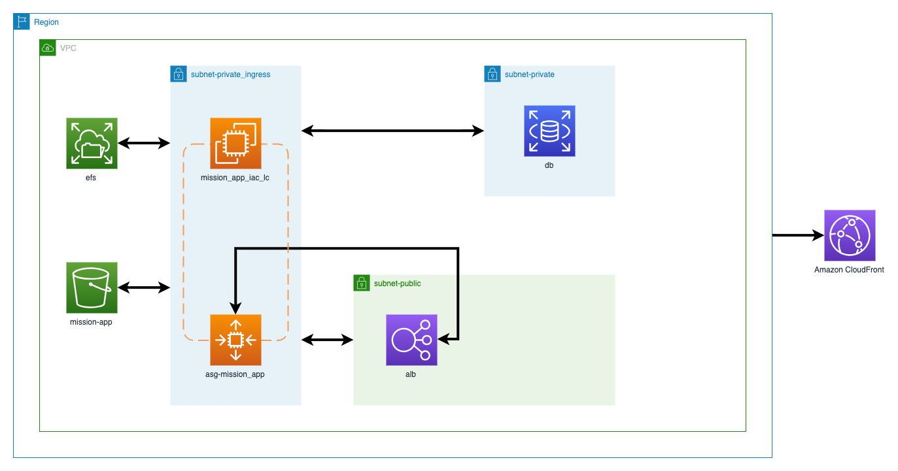

This is basically a refreshser of AWS on Terraform

This is from a tf on aws workshop - [click here for the link](https://catalog.us-east-1.prod.workshops.aws/workshops/41c5a1b6-bd3e-41f4-bd46-85ab7dc6dad4/en-US/0-introduction)

In this workshop, Terraform was used as the Infrastructure as Code (IaC) tool to deploy a highly available Wordpress application in a single region. It will be configured to leverage a Multi-AZ (data replication across multiple AZs) MySQL database and an auto-scaler based on CPU utilization for web hosting.

<h4> Architecture </h4>

  

   
 

The AWS Services that are used in this workshop are:

AWS Identity and Access Management  (AWS IAM) - securely manage identities and access to AWS services and resources  
Amazon Virtual Private Cloud  (Amazon VPC) - define and launch AWS resources in a logically isolated virtual environment  
Amazon Elastic Compute Cloud  (Amazon EC2) - provides scalable computing capacity  
Amazon Relational Database Service  (Amazon RDS) - fully managed, open-source cloud database service that allows you to easily operate and scale your relational database  
Amazon Simple Storage Service  (Amazon S3) - object storage service offering industry-leading scalability, data availability, security, and performance  
Amazon Elastic File System  (Amazon EFS) - serverless, fully elastic file storage  
AWS Simple Systems Manager  (SSM) - operations hub for your AWS applications and resources and a secure end-to-end management solution  
AWS Secrets Manager  - manage, retrieve, and rotate database credentials, tokens, API keys, and other secrets  
AWS Certificate Manager  (ACM) - provision and manage SSL/TLS certificates with AWS services and connected resources  
Amazon CloudFront  - content delivery network (CDN) service built for high performance, security, and developer convenience  